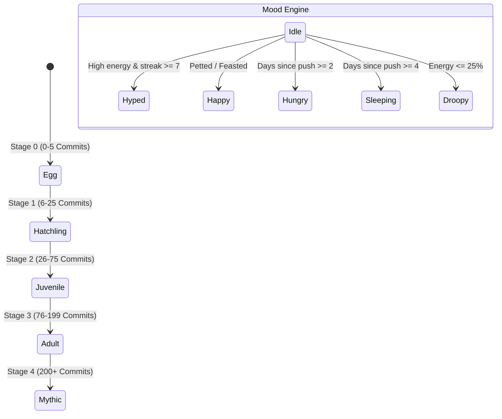

# 🐾 Commit Critter

> **Your first project. Your first commit. Your digital companion.**  
> Built for the **[Beginner's Paradise - FirstCommit Hackathon 2026](https://devpost.com)**.

[](https://devpost.com)
[](https://react.dev)
[](https://www.typescriptlang.org)
[](https://tailwindcss.com)
[](https://vitejs.dev)

---

## 🌟 What is Commit Critter?

**Commit Critter** is a browser-based virtual pet (Tamagotchi-style) that directly connects to your real-time **GitHub commit history**. 

It transforms daily coding into a rewarding, delightful habit:
- ⚡ **Fresh commits feed and energize your critter.**
- 🔥 **Consistent streaks increase its happiness and unlock joyful expressions.**
- 🧬 **Total lifetime commits trigger evolutionary leaps** from a tiny speckled egg to an Ascended Mythic Sovereign.
- 🎨 **Your dominant programming language determines its elemental form and personality** (Python $\rightarrow$ Flora Sprout, JavaScript $\rightarrow$ Volt Dynamo, Rust $\rightarrow$ Ferro Crab, Go $\rightarrow$ Tidal Sprite).
- 💤 **Quiet for a few days?** Your critter yawns, curls up, and takes a restorative nap until your next `git push`.

---

## 💡 Why Commit Critter Wins "Best Web/App Experience" & "Champion"

1. **Zero Friction Onboarding**: No registration, no passwords, no OAuth setup. Type any GitHub username or click a famous developer's profile (Linus Torvalds, Dan Abramov, Sindre Sorhus) for instant gratification.
2. **Procedural 8-bit Audio Engine**: Zero external audio files required! Synthesizes authentic retro chirps, crunching bites, purrs, and RPG level-up fanfares directly through the browser's Web Audio API.
3. **Judge Sandbox / Time Machine**: Built specifically for hackathon judging and the 3–5 minute video demo. Scrub days forward to test inactivity decay, simulate git pushes, and trigger instant evolutions on the fly.
4. **Spotify-Wrapped Style "Critter Passport"**: Renders high-resolution 1200x630 shareable cards via the HTML5 Canvas API with pet stats, QR code, and personal quirks ready for Twitter/X and LinkedIn.
5. **Authentic Handheld Nostalgia**: 4 interchangeable shell themes (DMG-01 Classic GameBoy, Cyberpunk 2077, Sakura Kawaii, Atomic 90s Purple) with realistic tactile buttons and CRT scanlines.

---

## 🎮 Handheld Shell Themes

| Shell Theme | Description |
| :--- | :--- |
| **DMG-01 Classic** | Iconic 1989 GameBoy gray shell with magenta action buttons and olive LCD grid. |
| **Cyberpunk 2077** | Sleek midnight obsidian casing with electric neon cyan and hot pink accents. |
| **Sakura Kawaii** | Pastel blush chassis with strawberry buttons and warm cream screen. |
| **Atomic 90s** | Translucent purple retro aesthetic with subtle circuitry glows. |

---

## 🧬 Biological State Engine & Evolution



### Elemental Affinities

- 🍃 **Flora (Python / Java / Kotlin)**: Sprouting leaf horns, emerald belly, and forest flora markings.
- ⚡ **Volt (JavaScript / TypeScript)**: Lightning antennae, energetic spark tail, and cyber yellow tones.
- 🦀 **Ferro (Rust / C / C++)**: Hardened copper armor, forge embers, and angular mecha claws.
- 🌊 **Tidal (Go / Ruby / PHP / Shell)**: Ocean crest, azure aquatic fins, and water droplet bubbles.
- 💎 **Prism (HTML / CSS / Swift)**: Prismatic crystal facets, iridescent magenta sheen.
- 🌌 **Void (Cosmic / Multi-language)**: Deep nebula purple with orbiting starlight particles.

---

## 🛠️ Tech Stack & Engineering Highlights

- **Framework**: React 18 with TypeScript (Strict mode enabled, 0 lint/compiler warnings)
- **Styling & Effects**: Tailwind CSS with custom scanlines, keyframe animations, and CRT phosphor matrices
- **Audio Synthesis**: Native Web Audio API (`AudioContext`, `OscillatorNode`, `GainNode`, procedural arpeggios)
- **Graphic Generation**: HTML5 Canvas 2D API for high-resolution 1200x630 social passport export
- **Data Ingestion**: Public GitHub REST API (`/users/{username}`, `/events/public`, `/repos`) with local cache rate-limit protection
- **Icons & Polish**: Lucide React & Canvas Confetti

---

## 🚀 Getting Started (Run Locally)

Judges and developers can launch Commit Critter locally in less than 60 seconds:

### Prerequisites
- Node.js (v18 or newer recommended)
- npm or pnpm

### Quick Installation

```bash
# 1. Clone the repository
git clone https://github.com/Trie-hard/Commit_Critter.git
cd Commit_Critter

# 2. Install dependencies
npm install

# 3. Start development server
npm run dev
```

Open your browser and navigate to `http://localhost:3000` (or the port displayed in your terminal).

To produce an optimized production build:
```bash
npm run build
npm run preview
```

---

## 🏆 Learning & Growth Reflections (Hackathon Journey)

The theme of *First Commit* is learning and challenging yourself. During this hackathon, we set out to build something that blends hardware nostalgia with live developer data:

1. **Procedural Web Audio**: Rather than relying on external `.mp3` files that fail to load or add bloat, we learned how to synthesize retro square waves, triangle hums, and frequency sweeps directly in browser memory using Web Audio API nodes.
2. **Finite State Machines (FSM)**: Modeling living digital biology requires clear state management. We architected a deterministic state machine mapping real Git events (push recency, streaks, code volume) to pet moods (sleeping, feasting, hyped, droopy).
3. **Canvas 2D Export**: Generating crisp, social-ready graphics with dynamic avatars and text metrics using the HTML5 Canvas API taught us deeply about pixel ratios, text alignment, and data URLs.
4. **Resilient API Design**: Handling GitHub unauthenticated rate limits gracefully by pairing live endpoints with client-side localStorage caching and instant demo fixtures ensures zero downtime during demos.

---

## 🎥 3–5 Minute Video Demo Script Outline

- **0:00 – 0:45**: **The Hook** — Introduce the problem: staying consistent as a beginner coder is tough, and git commits can feel dry. Meet *Commit Critter*!
- **0:45 – 1:30**: **Live Demo** — Type a GitHub handle, watch the critter hatch. Show the interactive Tamagotchi buttons (Petting purr, Feeding commit crunch).
- **1:30 – 2:30**: **The Time Machine** — Open the Judge Sandbox. Simulate +5 commits, watch the XP bar fill and trigger an evolution with fanfare and confetti. Advance 7 days to show sleep state.
- **2:30 – 3:15**: **Critter Passport** — Click "Passport Card", render the high-res 1200x630 card, and download the image.
- **3:15 – 3:45**: **Technical Architecture & What We Learned** — Highlight the procedural Web Audio engine, FSM biology, and rate-limit cache.
- **3:45 – 4:00**: **Conclusion** — Celebrate First Commit Hackathon 2026!

---

## 📜 License

Distributed under the **MIT License**. Feel free to use, modify, and build upon Commit Critter!
